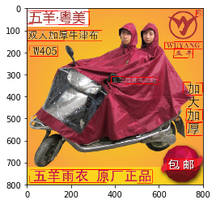

OCR_TIANCHI_ICPR

[The Alibaba TIANCHI OCR competition](https://tianchi.aliyun.com/competition/introduction.htm?spm=5176.100066.0.0.34b6d780oYcxs2&raceId=231650)

[CTPN reference](https://github.com/YCG09/chinese_ocr)

### Usage: 

- Download well-trained model from [here](https://www.floydhub.com/api/v1/resources/D9J7q8XFJNWdG4SjoZT6ag?content=true&download=true)

- Run the text_detector.ipynb

### Results:

